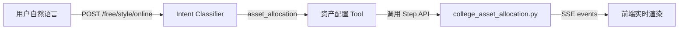
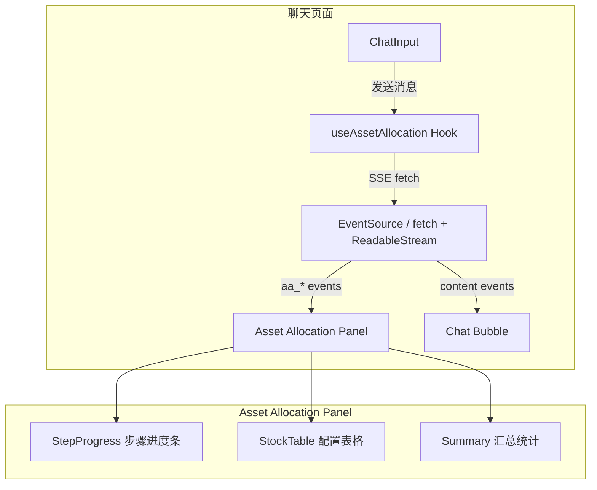

# 通过 Agent 对话接口驱动资产配置 — 方案设计

## 一、核心思路

用户通过 `/agent/free/style/online` 聊天接口发送自然语言指令，Agent 识别意图后调用资产配置 API，通过 **SSE 事件流** 实时推送进度和结果给前端。



## 二、对话流程示例

| # | 用户说 | Agent 回应 | 触发的 Step |
|---|--------|-----------|------------|
| 1 | "开始做资产配置" | 创建方案，返回 plan_id，引导输入公司名单 | `POST /plan` |
| 2 | "公司名单：贵州茅台、宁德时代、药明康德..." | 保存名单，引导配置资金 | `Step 01` |
| 3 | "总资金100万，场内子弹70%" | 保存配置，开始执行 | 更新 plan |
| 4 | "开始分析" 或 "执行配置" | 自动按序执行 Step 02→10，实时流式推送进度 | `Step 02-10` |
| 5 | "结束配置" | 生成总结报告 | 标记 plan 完成 |

## 三、后端设计

### 3.1 新增意图类型

在 `intent_classifier.py` 中增加 `asset_allocation` 意图：

```python
# 新增意图类型
# intent_type: "asset_allocation"
# 子类型通过 attributes.action 区分：
#   - "start"     → 开始配置
#   - "companies"  → 设置公司名单
#   - "config"     → 设置资金/比例
#   - "execute"    → 执行分析（批量跑 Step 02-10）
#   - "finish"     → 结束配置
```

### 3.2 新增 LangChain Tool：`AssetAllocationTool`

```python
# api/tools/asset_allocation_tool.py

class AssetAllocationTool(BaseTool):
    """
    资产配置工具 — 被 LangGraph Agent 调用
    
    接收用户自然语言指令，解析后调用对应的 Step API。
    返回结构化 JSON 事件，由 SSE 推送给前端。
    """
    name = "AssetAllocation"
    description = "执行二级市场资产配置流程..."
    
    async def _arun(self, instruction: str) -> str:
        # 解析用户指令
        action = parse_action(instruction)
        
        if action == "start":
            plan = await create_plan(user_id)
            return json.dumps({"event": "plan_created", "plan_id": plan.id})
            
        elif action == "execute":
            # 批量执行 Step 02-10，每步完成发一个事件
            for step in ["02","03","04","05","06","07","08","09","10"]:
                result = await execute_step(plan_id, step)
                yield_event({"event": f"step_{step}_done", "data": result})
            return json.dumps({"event": "all_steps_done"})
```

### 3.3 SSE 事件协议

Agent 通过 SSE 推送以下事件类型：

```typescript
type SSEEvent = 
  // 文本流（Agent 的自然语言回复）
  | { event: "content", data: string }
  
  // 资产配置专用事件
  | { event: "aa_plan_created",  data: { plan_id: number } }
  | { event: "aa_step_start",    data: { step: string, step_name: string } }
  | { event: "aa_step_done",     data: { step: string, stocks: Stock[], message: string } }
  | { event: "aa_step_error",    data: { step: string, error: string } }
  | { event: "aa_all_done",      data: { plan_id: number, summary: string } }
  
  // 工具调用/结果（已有）
  | { event: "tool_call",   data: { tool: string, tool_input: any } }
  | { event: "tool_result", data: { observation: string } }
  | { event: "done",        data: {} }
```

### 3.4 `/free/style/online` 中的路由

```python
# 在 free_style_online_chat 中增加意图路由
intent = classifier.classify(question)

if intent.question_type == "asset_allocation":
    # 走资产配置专用流程
    return await handle_asset_allocation(request, intent)
else:
    # 走原有 RAG 流程
    ...
```

> [!IMPORTANT]
> **关键设计决策**: `execute` 动作需要将单次请求拆分为多步SSE推送。不能让用户等到全部10步完成才返回。每完成一步就推送一次进度。

## 四、前端设计（重点）

### 4.1 架构概览



### 4.2 前端 SSE 处理（核心）

```tsx
// hooks/useAssetAllocation.ts

interface AAState {
  planId: number | null;
  currentStep: string;
  stocks: Stock[];
  stepMessages: Record<string, string>;  // step → 完成消息
  isExecuting: boolean;
}

function useAssetAllocation() {
  const [state, setState] = useState<AAState>(initialState);
  
  async function sendMessage(message: string) {
    setState(s => ({ ...s, isExecuting: true }));
    
    // 使用 fetch + ReadableStream 处理 SSE
    const response = await fetch('/api/agent/free/style/online', {
      method: 'POST',
      body: JSON.stringify({ question: message, session_id, user_id }),
    });
    
    const reader = response.body.getReader();
    const decoder = new TextDecoder();
    
    while (true) {
      const { done, value } = await reader.read();
      if (done) break;
      
      const text = decoder.decode(value);
      const events = parseSSEEvents(text);
      
      for (const evt of events) {
        switch (evt.event) {
          case 'aa_plan_created':
            setState(s => ({ ...s, planId: evt.data.plan_id }));
            break;
            
          case 'aa_step_start':
            setState(s => ({ ...s, currentStep: evt.data.step }));
            break;
            
          case 'aa_step_done':
            setState(s => ({
              ...s,
              stocks: evt.data.stocks,
              stepMessages: { ...s.stepMessages, [evt.data.step]: evt.data.message },
            }));
            break;
            
          case 'aa_all_done':
            setState(s => ({ ...s, isExecuting: false }));
            break;
            
          case 'content':
            // 追加到聊天气泡
            appendToChatBubble(evt.data);
            break;
        }
      }
    }
  }
  
  return { state, sendMessage };
}
```

### 4.3 前端组件结构

```
ChatPage
├── ChatHistory（聊天记录）
│   ├── UserBubble "开始做资产配置"
│   ├── AgentBubble "好的，请提供公司名单..."
│   ├── UserBubble "贵州茅台、宁德时代..."
│   ├── AgentBubble "名单已保存，请配置资金..."
│   ├── UserBubble "总资金100万，场内70%"
│   ├── AgentBubble "开始执行配置..."
│   └── AssetAllocationCard ← 嵌入在聊天流中的卡片
│       ├── StepProgressBar (02✅ 03✅ 04⏳ 05⬜ ...)
│       ├── StockConfigTable (和现有的表格一样)
│       └── AllocationSummary (总资金/场内/已配/剩余)
└── ChatInput
```

### 4.4 AssetAllocationCard 组件

```tsx
// components/AssetAllocationCard.tsx

function AssetAllocationCard({ planId, stocks, currentStep, stepMessages }) {
  return (
    <Card className="aa-card">
      {/* 步骤进度条 */}
      <Steps current={stepIndex(currentStep)} size="small">
        {STEPS.map(s => (
          <Step key={s.key} 
                title={s.name}
                status={getStepStatus(s.key, currentStep, stepMessages)}
                description={stepMessages[s.key] || ''}
          />
        ))}
      </Steps>
      
      {/* 配置表格（复用现有的 asset-allocation 表格组件） */}
      <StockTable stocks={stocks} />
      
      {/* 汇总统计 */}
      <AllocationSummary stocks={stocks} />
    </Card>
  );
}
```

> [!TIP]
> **关键点**: `AssetAllocationCard` 组件可以直接复用现有 `asset-allocation/index.tsx` 中的表格列定义和分组逻辑，只需要把它提取为独立组件。

## 五、实施步骤

### Phase 1: 后端（s-ai-agent）

| 步骤 | 内容 | 文件 |
|------|------|------|
| 1 | 意图分类增加 `asset_allocation` | `intent_classifier.py` + DB prompt |
| 2 | 创建 `AssetAllocationTool` | `api/tools/asset_allocation_tool.py` (新建) |
| 3 | 工具注册到 Agent | `main.py` 中 agent 初始化 |
| 4 | SSE 事件适配 | `langgraph_agent.py` astream 中识别 AA 事件 |
| 5 | 批量执行接口 | `college_asset_allocation.py` 增加 `execute_all_steps` |

### Phase 2: 前端（mgnt-agent-front）

| 步骤 | 内容 | 文件 |
|------|------|------|
| 1 | 创建 `useAssetAllocation` Hook | `hooks/useAssetAllocation.ts` (新建) |
| 2 | 创建 `AssetAllocationCard` 组件 | `components/AssetAllocationCard.tsx` (新建) |
| 3 | 提取表格/分组为复用组件 | 从 `asset-allocation/index.tsx` 提取 |
| 4 | 在聊天页面集成 | 聊天页面识别 `aa_*` 事件渲染卡片 |
| 5 | SSE 流解析器 | `utils/sseParser.ts` (新建) |

## 六、关键技术决策

### Q1: Agent 模式 vs 直接调用？
**选择 Agent 模式（通过 Tool）**。好处：
- 用户可以用自然语言交互（"把宁德时代去掉"、"总资金改成200万"）
- Agent 可以主动引导下一步操作
- 复用现有的聊天 UI 和 SSE 基础设施

### Q2: SSE 推送 vs WebSocket？
**选择 SSE（fetch + ReadableStream）**。因为：
- 现有 `/free/style/online` 已是 POST → JSON 返回的模式
- 可以改为 `StreamingResponse` 返回 SSE，前端用 `fetch` 的 `body.getReader()` 接收
- 不需要引入新协议

### Q3: 前端渲染位置？
**嵌入聊天流中（作为特殊的 AgentBubble）**。而不是跳转到独立页面。
- 用户在聊天中看到步骤卡片实时更新
- 可以随时发消息修改配置
- 保持对话上下文

> [!WARNING]
> **注意**: 批量执行 Step 02-10 可能耗时 30-60s（含 LLM 调用）。必须使用 SSE 流式推送，不能等全部完成才返回。前端需要有 loading 状态和步骤进度条。
