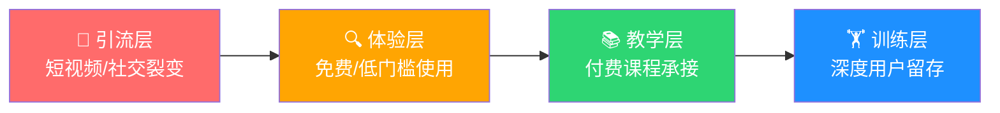
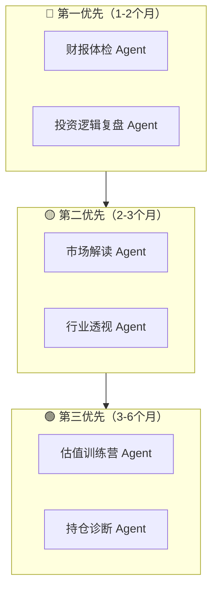

# 🧠 S5000AI Agent 细分场景战略规划

## 一、核心原则

> **不荐股，教方法；不给鱼，给渔网。**

监管红线很清晰：不能说"买XX股票"。但价值投资的本质是**分析框架 + 独立思考能力**，这恰好是 Agent 最擅长的——不是给答案，而是**带着用户走完分析过程**。

这与你们的商业模式天然契合：
```
Agent 教方法 → 用户觉得"这个方法真有用" → 想系统学 → 599 → 60000
```

---

## 二、场景矩阵：6 个核心 Agent

> 按 **用户转化漏斗** 排序：从引流（低门槛）到留存（高粘性）



---

### 场景 1：📊 财报体检 Agent（引流利器）

**定位**：用户说一个公司名字，Agent 自动拉取财务数据，像医生看体检报告一样给出"健康诊断"。

**为什么是引流利器**：
- 每个投资者都好奇自己持仓的"体检报告"
- 适合短视频引流："输入任意股票名，AI 10秒给出体检报告"
- 结果天然适合截图分享 → 社交裂变

**不踩红线的方式**：
- 只输出**客观数据 + 分析框架**，不输出"买入/卖出"结论
- 用"健康/亚健康/需关注"代替"推荐/不推荐"
- 每个指标都附带"S老师说"的教学解读

**输出示例**：
```
📊 贵州茅台 财务体检报告

🫀 盈利能力：优秀 ★★★★★
  · ROE 连续5年 > 25%（优秀企业标准 > 15%）
  · 毛利率 91.5%（行业前 1%）
  → S老师说：ROE 是巴菲特最看重的指标...

💰 现金流：健康 ★★★★☆
  · 经营现金流/净利润 = 1.2（> 1 说明利润含金量高）
  → 想深入学习现金流分析？📹 推荐课程：《三张报表找好公司》

⚠️ 需要关注：
  · 应收账款周转天数同比↑ 15%
  → 这可能意味着什么？来 S5000AI 深度对话了解更多
```

**技术实现**：
- 现有 `s-ai-agent` 的 company_identify + 维度分析已有基础
- 新增**财报数据源接入**（东方财富/同花顺 API）
- 输出模板化（体检报告卡片）

---

### 场景 2：🔬 行业透视 Agent（建立专业壁垒）

**定位**：用户问"新能源行业怎么样"，Agent 不是简单回答，而是**带着用户走一遍行业分析框架**。

**差异化价值**：
- 市面上的 AI 只给一段话的"行业概述"
- S5000AI 给出**结构化的行业分析地图**，教用户"如何自己分析一个行业"

**不踩红线**：
- 分析的是"行业"不是"个股"
- 教的是"方法"不是"结论"

**输出结构**：
```
🔬 新能源汽车行业透视

📐 行业生命周期：成长中期
  · 渗透率 38%（S老师框架：< 20% 导入期，20-50% 成长期，> 50% 成熟期）

🏰 竞争格局：
  · CR5 = 62%（集中度高，头部效应明显）
  · 护城河类型：规模效应 + 技术壁垒

📈 关键驱动因素：
  · 政策端：补贴退坡但碳积分政策加码
  · 需求端：下沉市场渗透率仅 18%
  · 供给端：固态电池量产时间表

🎯 价值投资者应关注的核心问题：
  1. 谁在这个行业有定价权？
  2. 技术路线是否会颠覆现有格局？
  3. 哪个环节的利润率最稳定？

💡 想掌握完整的行业分析框架？
  📹 推荐课程：《产业链分析方法论》
```

**技术实现**：
- 复用现有 RAG 知识库（行业研报）
- 新增行业数据 API 接入
- 结构化 Prompt（S老师的行业分析框架模板化）

---

### 场景 3：📝 投资逻辑复盘 Agent（高粘性，高转化）

**定位**：用户描述自己买了某个公司的理由，Agent **站在S老师的角度做"逻辑审计"**。

**为什么高转化**：
- 直接切入用户最痛的需求："我买的对不对？我的分析有没有漏洞？"
- 用完之后用户会觉得"S老师的方法论太有用了" → 转化 599/60000

**不踩红线**：
- 不说"该不该买"，而是"你的分析逻辑有哪些盲区"
- 就像论文查重，查的是"逻辑漏洞"而非给"买入信号"

**交互示例**：
```
👤 用户：我买了比亚迪，因为新能源车销量第一，技术领先

🤖 Agent：让我用 S老师的五维分析框架检查一下你的投资逻辑：

✅ 你提到了：
  · 市场地位（销量第一）→ 属于"竞争格局"维度 ✓
  · 技术优势 → 属于"护城河"维度 ✓

⚠️ 你可能遗漏了：
  · 【估值维度】当前 PE/分位数是多少？是否在合理区间？
  · 【现金流维度】资本支出这么大，自由现金流还剩多少？
  · 【管理层维度】王传福近两年的资本配置决策是否理性？

📌 S老师说："好公司不等于好投资，关键是在合理的价格买入"

🔍 建议你补充分析：
  1. 查看 DCF 估值是否有安全边际
  2. 对比宁德时代的 ROE 趋势
  3. 关注汽车出口政策风险

💡 想系统学习五维分析法？→ 《价值投资实战课》
```

**技术实现**：
- Prompt 核心：S老师的"五维分析框架"结构化模板
- 用户输入 → LLM 提取"已提及维度" vs "未提及维度"
- 针对未提及维度给出具体建议

---

### 场景 4：📰 市场解读 Agent（日活担当）

**定位**：每天的市场热点、财经新闻，用**价值投资的视角**解读，而非跟风追热点。

**为什么是日活担当**：
- 每天都有新闻 = 每天都有使用理由
- "今天市场大跌，S5000AI 怎么看" → 培养用户每日打开习惯

**不踩红线**：
- 解读的是"事件对行业/公司基本面的影响"
- 不输出"抄底/逃顶"等操作性结论
- 培养用户"用基本面思考市场波动"的习惯

**输出示例**：
```
📰 今日价值投资视角

🔥 热点：美联储暗示年内可能降息

📐 价值投资者思考框架：
  1. 对 A 股意味着什么？
     → 利率下行 → 成长股估值天花板抬升（但不意味着现在就应该行动）
  
  2. 应该关注什么？
     → 降息周期中，哪些行业的自由现金流会实质改善？
     → 历史上 3 次降息周期，A 股表现如何？
  
  3. 不应该做什么？
     → 不应因为一条消息就改变长期持仓逻辑
     → S老师说："市场先生今天报的价，和公司值多少钱，是两件事"

📹 相关课程：《如何在市场波动中保持理性》
```

**技术实现**：
- 接入财经新闻 API（新浪财经/东方财富）
- 每日定时任务生成解读（可复用现有 scheduler）
- 用 RAG 关联 S老师的历史观点

---

### 场景 5：🎓 估值训练营 Agent（课程增值）

**定位**：交互式估值训练，Agent 充当"助教"，一步步引导用户完成一家公司的估值。

**为什么是课程增值**：
- 599/60000 课程学完了，还需要"练手"
- 一对一助教太贵，AI 助教可以无限扩展
- 做对了有成就感 → 分享 → 裂变

**交互流程**：
```
🤖：欢迎来到估值训练营！请选择一家你感兴趣的公司来练习
👤：海天味业

🤖：好的！让我们用 DCF 三步法来估值海天味业
    第一步：确定自由现金流
    → 请打开海天味业2024年报，告诉我：
    · 经营活动现金流净额是多少？
    · 资本性支出（购建固定资产）是多少？

👤：经营现金流 65亿，资本支出 12亿

🤖：✅ 正确！那么自由现金流 = 65 - 12 = 53亿
    → 过去5年的自由现金流趋势是 42→45→50→48→53，整体向上 ✓
    
    第二步：确定增长率
    → S老师方法：用 ROE × 留存率 来估算可持续增长率
    → 海天的 ROE 是 28%，分红率约 60%，请你算一下可持续增长率？

👤：28% × 40% = 11.2%

🤖：✅ 优秀！接下来第三步...
```

**技术实现**：
- 多轮对话 Agent（已有 session 机制）
- 预设训练流程模板（DCF/PE/PB 三种方法）
- 自动抓取实时财务数据验证用户输入

---

### 场景 6：📋 持仓诊断 Agent（高端用户深度服务）

**定位**：针对 60000 学员或准学员，提供持仓组合的"方法论诊断"。

**与场景3的区别**：
- 场景3 是单只股票的逻辑审计
- 场景6 是整个组合的结构性诊断（集中度、行业分布、相关性等）

**不踩红线**：
- 诊断的是"组合结构是否符合价值投资原则"
- 不输出"加仓/减仓"建议

**输出示例**：
```
📋 持仓组合诊断报告

🎯 组合概况：5 只股票

⚠️ 诊断发现：

1. 行业集中度过高
   · 消费占 60%（茅台+海天+伊利）
   · 巴菲特建议：单一行业不超过 40%

2. 相关性风险
   · 茅台和伊利在消费降级时会同向下跌
   · 建议思考：是否需要低相关性行业对冲？

3. 估值分位
   · 3/5 只股票的 PE 在历史 70% 以上分位
   · S老师说："好公司也要在合理价格买"

📌 方法论建议：
   · 重新审视每只股票的买入逻辑
   · 用凯利公式评估每只的仓位比例
   · 至少保留 20% 现金应对错误定价机会
```

---

## 三、优先级建议



| 优先级 | Agent | 理由 |
|--------|-------|------|
| **P0** | 财报体检 | 引流效果最强，技术实现最快（已有公司识别+维度分析基础） |
| **P0** | 投资逻辑复盘 | 转化效果最强，直接对接 599→60000 |
| **P1** | 市场解读 | 提升日活，培养用户习惯 |
| **P1** | 行业透视 | 建立专业壁垒，与竞品拉开差距 |
| **P2** | 估值训练营 | 课程增值，但需要较多交互设计 |
| **P2** | 持仓诊断 | 高端功能，服务 VIP 学员 |

---

## 四、竞争壁垒 = S老师方法论 × AI 能力

> **壁垒不在技术，在于"S老师的投资方法论"被高质量地结构化了。**

| 竞品能做到的 | S5000AI 独有的 |
|-------------|---------------|
| 通用 AI 回答 | S老师的五维分析框架 |
| 数据罗列 | 数据 + "S老师说"的解读方法论 |
| 一次性回答 | 引导式对话（带用户走完分析流程） |
| 冷冰冰的文字 | 数字人 + 情感化表达 |
| 单一场景 | 学习→练习→复盘 完整闭环 |

**技术上的护城河**：
1. **S老师方法论 RAG 知识库**：把线下课精华结构化灌入知识库，别人抄不走
2. **行业数据管道**：财报/行情/研报数据自动化接入
3. **多轮引导 Agent**：不是 Q&A，是"带着分析"的教练式对话
4. **视频课程智能推荐**：已完成基础建设（刚开发的 LLM 语义匹配）

---

## 五、与现有营收链路的整合

```
短视频 → 9.9 预约 → 直播间 → 599 私域课 → 60000 线下课
                              ↑                    ↑
                        S5000AI 免费体验        S5000AI VIP功能
                        (财报体检/市场解读)      (估值训练/持仓诊断)
```

- **免费功能**（财报体检、市场解读）→ 短视频引流素材，每日推送
- **599 课程赠品**（行业透视、投资复盘）→ 提升 599 课程价值感
- **60000 学员专属**（估值训练营、持仓诊断）→ 增加学员续费/转介绍

---

## 六、下一步行动

> [!IMPORTANT]
> 建议立即启动 **财报体检 Agent**，它是引流、转化、技术难度三者的最优交集。

1. **本周**：梳理 S老师"财务体检"的分析框架，结构化为 Prompt 模板
2. **下周**：接入 1-2 个免费财务数据 API（东方财富/Tushare）
3. **两周内**：完成 MVP，在小程序内上线"公司体检"入口
4. **一个月**：根据用户反馈迭代，同步启动"投资逻辑复盘 Agent"
