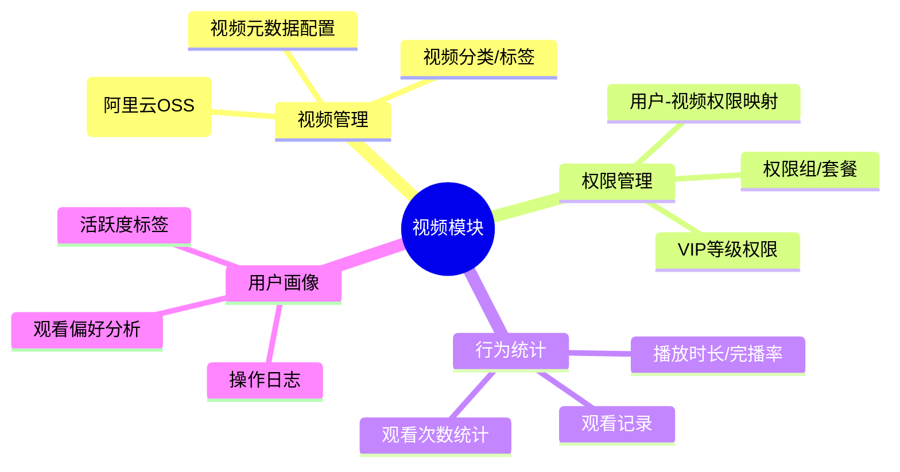
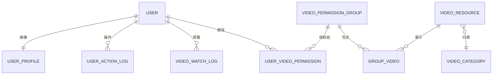

# S5000AI 视频模块设计与实施方案

## 一、现有系统分析

### 当前架构
| 组件 | 技术栈 | 说明 |
|-----|--------|------|
| 前端 | `wx-mini-S5000AI` (微信小程序) | Vant Weapp + miniprogram-computed |
| 后端 | `dify-api-openservice` (Java/Spring Boot) | 多模块 Maven 项目 |
| 视频存储 | 阿里云 OSS | `s-ai-video.oss-cn-beijing.aliyuncs.com` |
| API 域名 | `wx-ai.baozangshijie.cn` | 线上环境 |

### 已有基础
- ✅ 视频播放页 `pages/video/index` — 支持直链播放 + 推荐报告
- ✅ OSS 视频获取 `api/bzsj.js → getVideo()` — 简单拼接 URL
- ✅ 用户权限接口 [getPermissions](file:///D:/Evan/Codes/wx-mini-S5000AI/api/bzsj.js#451-455) — `UserController.java:901`
- ✅ 学生权限表 `StudentPermissionInfoMapper` — 已有权限数据模型
- ✅ 视频/课程配置 `AiCourseVideoConfigMapper` — 已有视频配置模型

---

## 二、需求拆解



---

## 三、数据库设计

### 3.1 视频资源表 `ai_video_resource`

```sql
CREATE TABLE ai_video_resource (
    id              BIGINT AUTO_INCREMENT PRIMARY KEY,
    title           VARCHAR(200) NOT NULL COMMENT '视频标题',
    description     TEXT COMMENT '视频简介',
    oss_key         VARCHAR(500) NOT NULL COMMENT 'OSS存储路径(不含域名)',
    oss_url         VARCHAR(1000) COMMENT '完整播放URL(含签名)',
    cover_url       VARCHAR(1000) COMMENT '封面图URL',
    category_id     BIGINT COMMENT '分类ID',
    tags            VARCHAR(500) COMMENT '标签(逗号分隔)',
    duration        INT DEFAULT 0 COMMENT '时长(秒)',
    file_size       BIGINT DEFAULT 0 COMMENT '文件大小(字节)',
    sort_order      INT DEFAULT 0 COMMENT '排序(越小越前)',
    access_level    TINYINT DEFAULT 0 COMMENT '0=免费 1=VIP 2=指定权限',
    status          TINYINT DEFAULT 1 COMMENT '0=下架 1=上架',
    view_count      INT DEFAULT 0 COMMENT '累计播放次数',
    created_at      DATETIME DEFAULT CURRENT_TIMESTAMP,
    updated_at      DATETIME DEFAULT CURRENT_TIMESTAMP ON UPDATE CURRENT_TIMESTAMP,
    INDEX idx_category (category_id),
    INDEX idx_status_sort (status, sort_order),
    INDEX idx_access_level (access_level)
) ENGINE=InnoDB DEFAULT CHARSET=utf8mb4 COMMENT='视频资源表';
```

### 3.2 视频分类表 `ai_video_category`

```sql
CREATE TABLE ai_video_category (
    id              BIGINT AUTO_INCREMENT PRIMARY KEY,
    name            VARCHAR(100) NOT NULL COMMENT '分类名称',
    icon            VARCHAR(200) COMMENT '分类图标',
    parent_id       BIGINT DEFAULT 0 COMMENT '父分类ID(0=一级)',
    sort_order      INT DEFAULT 0,
    status          TINYINT DEFAULT 1,
    created_at      DATETIME DEFAULT CURRENT_TIMESTAMP,
    INDEX idx_parent (parent_id)
) ENGINE=InnoDB DEFAULT CHARSET=utf8mb4 COMMENT='视频分类表';
```

### 3.3 视频权限组表 `ai_video_permission_group`

```sql
CREATE TABLE ai_video_permission_group (
    id              BIGINT AUTO_INCREMENT PRIMARY KEY,
    group_name      VARCHAR(100) NOT NULL COMMENT '权限组名称(如: 基础课程包/进阶课程包)',
    description     VARCHAR(500) COMMENT '描述',
    status          TINYINT DEFAULT 1,
    created_at      DATETIME DEFAULT CURRENT_TIMESTAMP
) ENGINE=InnoDB DEFAULT CHARSET=utf8mb4 COMMENT='视频权限组(课程包)';
```

### 3.4 权限组-视频关联表 `ai_video_permission_group_video`

```sql
CREATE TABLE ai_video_permission_group_video (
    id              BIGINT AUTO_INCREMENT PRIMARY KEY,
    group_id        BIGINT NOT NULL COMMENT '权限组ID',
    video_id        BIGINT NOT NULL COMMENT '视频ID',
    created_at      DATETIME DEFAULT CURRENT_TIMESTAMP,
    UNIQUE KEY uk_group_video (group_id, video_id),
    INDEX idx_video (video_id)
) ENGINE=InnoDB DEFAULT CHARSET=utf8mb4 COMMENT='权限组与视频关联';
```

### 3.5 用户-权限组关联表 `ai_user_video_permission`

```sql
CREATE TABLE ai_user_video_permission (
    id              BIGINT AUTO_INCREMENT PRIMARY KEY,
    user_id         BIGINT NOT NULL COMMENT '用户ID',
    group_id        BIGINT NOT NULL COMMENT '权限组ID',
    source          VARCHAR(50) DEFAULT 'manual' COMMENT '来源: manual/vip/purchase',
    expire_at       DATETIME COMMENT '过期时间(NULL=永久)',
    status          TINYINT DEFAULT 1 COMMENT '0=禁用 1=启用',
    created_at      DATETIME DEFAULT CURRENT_TIMESTAMP,
    UNIQUE KEY uk_user_group (user_id, group_id),
    INDEX idx_user (user_id),
    INDEX idx_expire (expire_at)
) ENGINE=InnoDB DEFAULT CHARSET=utf8mb4 COMMENT='用户视频权限';
```

### 3.6 视频观看记录表 `ai_video_watch_log`

```sql
CREATE TABLE ai_video_watch_log (
    id              BIGINT AUTO_INCREMENT PRIMARY KEY,
    user_id         BIGINT NOT NULL COMMENT '用户ID',
    video_id        BIGINT NOT NULL COMMENT '视频ID',
    watch_duration  INT DEFAULT 0 COMMENT '本次观看时长(秒)',
    total_duration  INT DEFAULT 0 COMMENT '视频总时长(秒)',
    progress        DECIMAL(5,2) DEFAULT 0 COMMENT '观看进度(%)',
    completed       TINYINT DEFAULT 0 COMMENT '是否完播: 0=否 1=是(>=90%)',
    client_ip       VARCHAR(50) COMMENT '客户端IP',
    device_info     VARCHAR(200) COMMENT '设备信息',
    created_at      DATETIME DEFAULT CURRENT_TIMESTAMP,
    INDEX idx_user_video (user_id, video_id),
    INDEX idx_video (video_id),
    INDEX idx_created (created_at)
) ENGINE=InnoDB DEFAULT CHARSET=utf8mb4 COMMENT='视频观看记录';
```

### 3.7 用户操作日志表 `ai_user_action_log`

```sql
CREATE TABLE ai_user_action_log (
    id              BIGINT AUTO_INCREMENT PRIMARY KEY,
    user_id         BIGINT NOT NULL,
    action_type     VARCHAR(50) NOT NULL COMMENT '动作类型: video_play/video_pause/video_complete/page_view/share/...',
    target_type     VARCHAR(50) COMMENT '目标类型: video/page/report',
    target_id       VARCHAR(100) COMMENT '目标ID',
    extra_data      JSON COMMENT '扩展数据(视频进度/来源页/分享渠道等)',
    client_ip       VARCHAR(50),
    device_info     VARCHAR(200),
    created_at      DATETIME DEFAULT CURRENT_TIMESTAMP,
    INDEX idx_user (user_id),
    INDEX idx_action (action_type),
    INDEX idx_target (target_type, target_id),
    INDEX idx_created (created_at)
) ENGINE=InnoDB DEFAULT CHARSET=utf8mb4 COMMENT='用户操作日志(用户画像数据源)';
```

### 3.8 用户画像表 `ai_user_profile`

```sql
CREATE TABLE ai_user_profile (
    id              BIGINT AUTO_INCREMENT PRIMARY KEY,
    user_id         BIGINT NOT NULL UNIQUE COMMENT '用户ID',
    total_watch_time INT DEFAULT 0 COMMENT '累计观看时长(秒)',
    total_videos     INT DEFAULT 0 COMMENT '累计观看视频数',
    completed_videos INT DEFAULT 0 COMMENT '完播视频数',
    last_watch_at    DATETIME COMMENT '最后观看时间',
    favorite_categories VARCHAR(500) COMMENT '偏好分类(JSON)',
    active_level     TINYINT DEFAULT 0 COMMENT '活跃等级: 0=沉默 1=低活 2=中活 3=高活',
    user_tags        VARCHAR(500) COMMENT '用户标签(JSON数组)',
    updated_at       DATETIME DEFAULT CURRENT_TIMESTAMP ON UPDATE CURRENT_TIMESTAMP,
    INDEX idx_active (active_level),
    INDEX idx_last_watch (last_watch_at)
) ENGINE=InnoDB DEFAULT CHARSET=utf8mb4 COMMENT='用户画像';
```

---

## 四、后端设计 (dify-api-openservice)

### 4.1 新增 Controller

#### `VideoController.java`

| 接口 | 方法 | 路径 | 说明 |
|-----|------|------|------|
| 视频列表 | GET | `/video/list` | 按分类/标签筛选，结合用户权限过滤 |
| 视频详情 | GET | `/video/detail` | 含播放URL（OSS签名URL）+ 权限校验 |
| 获取播放URL | POST | `/video/playUrl` | 鉴权后生成临时签名URL(防盗链) |
| 上报观看记录 | POST | `/video/watch/report` | 前端定时上报播放进度 |
| 观看历史 | GET | `/video/watch/history` | 用户观看记录列表 |
| 分类列表 | GET | `/video/category/list` | 视频分类树 |

#### `VideoPermissionController.java`（管理后台）

| 接口 | 方法 | 路径 | 说明 |
|-----|------|------|------|
| 权限组列表 | GET | `/admin/video/permission/groups` | 管理权限组 |
| 创建权限组 | POST | `/admin/video/permission/group` | 新建课程包 |
| 权限组绑定视频 | POST | `/admin/video/permission/bindVideos` | 关联视频 |
| 用户授权 | POST | `/admin/video/permission/grant` | 给用户分配权限组 |
| 用户权限查询 | GET | `/admin/video/permission/userPermissions` | 查看用户权限 |

#### `UserActionLogController.java`

| 接口 | 方法 | 路径 | 说明 |
|-----|------|------|------|
| 上报操作日志 | POST | `/user/action/log` | 通用操作日志上报 |
| 用户画像 | GET | `/user/profile` | 获取用户画像数据 |

### 4.2 核心 Service 逻辑

#### 视频播放鉴权流程

```
用户请求播放 → 查询 ai_user_video_permission → 
  ├─ access_level=0(免费) → 直接返回URL
  ├─ access_level=1(VIP) → 校验VIP有效期
  └─ access_level=2(指定权限) → 校验权限组+有效期
       ├─ 有权 → 生成OSS临时签名URL(有效期2h) → 返回
       └─ 无权 → 返回403 + 提示购买/升级
```

#### OSS 签名 URL 生成（防盗链）

```java
// VideoService.java
public String generateSignedUrl(String ossKey) {
    Date expiration = new Date(System.currentTimeMillis() + 2 * 3600 * 1000); // 2小时
    URL signedUrl = ossClient.generatePresignedUrl(bucketName, ossKey, expiration);
    return signedUrl.toString();
}
```

#### 观看进度上报处理

```java
// VideoWatchService.java
public void reportWatch(Long userId, Long videoId, int watchDuration, int totalDuration) {
    // 1. 写入观看记录
    double progress = totalDuration > 0 ? (watchDuration * 100.0 / totalDuration) : 0;
    boolean completed = progress >= 90;
    // INSERT ai_video_watch_log
    
    // 2. 更新视频播放次数
    // UPDATE ai_video_resource SET view_count = view_count + 1 WHERE id = videoId
    
    // 3. 更新用户画像
    // UPDATE ai_user_profile SET total_watch_time += watchDuration, ...
}
```

### 4.3 新增 DAO 层

| Mapper | 表 |
|--------|---|
| `AiVideoResourceMapper` | ai_video_resource |
| `AiVideoCategoryMapper` | ai_video_category |
| `AiVideoPermissionGroupMapper` | ai_video_permission_group |
| `AiVideoPermissionGroupVideoMapper` | ai_video_permission_group_video |
| `AiUserVideoPermissionMapper` | ai_user_video_permission |
| `AiVideoWatchLogMapper` | ai_video_watch_log |
| `AiUserActionLogMapper` | ai_user_action_log |
| `AiUserProfileMapper` | ai_user_profile |

---

## 五、前端设计 (wx-mini-S5000AI)

### 5.1 新增/改造页面

#### 📺 视频中心页 `pages/videoCenter/index`（新增）

```
┌──────────────────────────────────────┐
│  🔍 搜索视频                          │
├──────────────────────────────────────┤
│ [全部] [基础课程] [进阶课程] [直播回放] │  ← 分类Tab
├──────────────────────────────────────┤
│ ┌──────┐ ┌──────┐                    │
│ │ 封面  │ │ 封面  │                    │
│ │ 🔒/▶ │ │  ▶   │                    │  ← 视频卡片(锁=无权限)
│ │ 标题  │ │ 标题  │                    │
│ │ 3:25  │ │ 5:10  │                    │
│ └──────┘ └──────┘                    │
│ ...                                  │
├──────────────────────────────────────┤
│ 📊 我的观看历史  →                     │  ← 入口
└──────────────────────────────────────┘
```

#### 📼 视频播放页 `pages/video/index`（改造）

改造要点：
- 进入时校验权限（调 `/video/playUrl`），无权限弹窗提示
- 播放开始时上报 `video_play` 日志
- **每30秒**定时上报观看进度（`/video/watch/report`）
- 播放暂停/结束时上报最终进度
- 视频完播时上报 `video_complete` 日志

#### 📋 观看历史页 `pages/videoHistory/index`（新增）

列出用户历史观看记录，显示进度条、完播标记。

### 5.2 新增 API 接口

```javascript
// api/bzsj.js 新增

// ==================== 视频模块 ====================

// 视频列表
export function getVideoList(params) {
    const url = base_url + '/video/list';
    request(url, { method: 'GET', ...params })
}

// 视频详情+播放URL
export function getVideoPlayUrl(params) {
    const url = base_url + '/video/playUrl';
    request(url, { method: 'POST', ...params })
}

// 分类列表
export function getVideoCategories(params) {
    const url = base_url + '/video/category/list';
    request(url, { method: 'GET', ...params })
}

// 上报观看进度
export function reportVideoWatch(params) {
    const url = base_url + '/video/watch/report';
    request(url, { method: 'POST', ...params }, { showLoading: false, showErrorToast: false })
}

// 观看历史
export function getVideoWatchHistory(params) {
    const url = base_url + '/video/watch/history';
    request(url, { method: 'GET', ...params })
}

// 通用操作日志上报
export function reportUserAction(params) {
    const url = base_url + '/user/action/log';
    request(url, { method: 'POST', ...params }, { showLoading: false, showErrorToast: false })
}
```

### 5.3 播放进度上报策略

```javascript
// pages/video/index.js 改造核心逻辑

let reportTimer = null;

onLoad(options) {
    // ... 现有逻辑 ...
    
    // 权限检查
    this.checkVideoPermission(videoId);
},

// 权限校验
async checkVideoPermission(videoId) {
    api.bzsj.getVideoPlayUrl({
        data: { videoId },
        success: (res) => {
            this.setData({ videoUrl: res.signedUrl, hasPermission: true });
            this.reportAction('video_play', 'video', videoId);
        },
        fail: (err) => {
            if (err.code === 403) {
                this.setData({ hasPermission: false, lockReason: err.message });
            }
        }
    });
},

// 开始播放时启动定时上报
onPlay() {
    reportTimer = setInterval(() => {
        this.reportWatchProgress();
    }, 30000); // 每30秒
},

// 上报观看进度
reportWatchProgress() {
    api.bzsj.reportVideoWatch({
        data: {
            videoId: this.data.id,
            watchDuration: Math.floor(this.data.currentTime),
            totalDuration: Math.floor(this.data.duration)
        }
    });
},

// 暂停/退出时上报最终进度
onPause() { this.reportWatchProgress(); },
onUnload() {
    if (reportTimer) clearInterval(reportTimer);
    this.reportWatchProgress();
},

// 通用操作日志
reportAction(actionType, targetType, targetId, extra = {}) {
    api.bzsj.reportUserAction({
        data: { actionType, targetType, targetId, extraData: JSON.stringify(extra) }
    });
}
```

---

## 六、权限设计模型



### 权限判断逻辑

```
用户请求视频 →
  视频.access_level == 0(免费) → ✅ 直接播放
  视频.access_level == 1(VIP)  → 检查用户VIP有效期 → ✅/❌
  视频.access_level == 2(指定) → 
    查 ai_video_permission_group_video 获取该视频所属的权限组IDs →
    查 ai_user_video_permission 判断用户是否拥有任一权限组且未过期 →
    ✅ 有权 / ❌ 无权
```

---

## 七、用户画像建设

### 7.1 采集的操作日志事件

| action_type | 触发时机 | extra_data |
|------------|---------|------------|
| `video_play` | 开始播放 | `{videoId, source: "list/share/push"}` |
| `video_pause` | 暂停播放 | `{videoId, progress, watchDuration}` |
| `video_complete` | 完播(≥90%) | `{videoId, totalDuration}` |
| `video_seek` | 拖动进度条 | `{videoId, from, to}` |
| `page_view` | 进入页面 | `{page, referrer}` |
| [share](file:///D:/Evan/Codes/wx-mini-S5000AI/api/bzsj.js#263-267) | 分享 | `{type, targetId}` |
| [search](file:///D:/Evan/Codes/ai-stock/api/main.py#2901-2992) | 搜索 | `{keyword}` |
| [login](file:///D:/Evan/Codes/wx-mini-S5000AI/api/bzsj.js#22-26) | 登录 | `{method}` |

### 7.2 画像标签计算（后台定时任务，每日凌晨）

```java
// UserProfileService.java
public void calculateUserProfile(Long userId) {
    // 1. 统计近30天数据
    int totalWatchTime = watchLogMapper.sumWatchDuration(userId, last30Days);
    int totalVideos = watchLogMapper.countDistinctVideos(userId, last30Days);
    int completedVideos = watchLogMapper.countCompleted(userId, last30Days);
    
    // 2. 活跃等级
    int activeLevel = 0;  // 沉默
    if (totalWatchTime > 3600) activeLevel = 3;      // 高活(>1小时/月)
    else if (totalWatchTime > 1800) activeLevel = 2;  // 中活(>30分钟/月)
    else if (totalWatchTime > 300) activeLevel = 1;   // 低活(>5分钟/月)
    
    // 3. 偏好分类(按观看时长排序)
    List<CategoryStat> favCategories = watchLogMapper.categoryStats(userId, last30Days);
    
    // 4. 用户标签
    List<String> tags = new ArrayList<>();
    if (completedVideos > 10) tags.add("学习达人");
    if (totalWatchTime > 7200) tags.add("深度用户");
    if (lastWatchAt > yesterday) tags.add("近期活跃");
    
    // 5. 更新画像
    profileMapper.upsert(userId, totalWatchTime, totalVideos, completedVideos, activeLevel, tags);
}
```

---

## 八、实施计划

### 第一阶段：基础功能（3~5天）

| 序号 | 任务 | 端 | 天数 |
|------|------|---|------|
| 1 | 建表(8张) + MyBatis Mapper + Entity | 后端 | 0.5 |
| 2 | `VideoController` + `VideoService` (列表/详情/播放URL) | 后端 | 1 |
| 3 | `VideoPermissionController` (权限管理CRUD) | 后端 | 1 |
| 4 | 视频中心页 `videoCenter` (列表/分类/权限锁) | 前端 | 1 |
| 5 | 改造播放页 (权限校验 + 签名URL) | 前端 | 0.5 |
| 6 | API 接口联调 | 前后端 | 0.5 |

### 第二阶段：统计与日志（2~3天）

| 序号 | 任务 | 端 | 天数 |
|------|------|---|------|
| 7 | 观看进度上报接口 + 定时上报机制 | 前后端 | 1 |
| 8 | 操作日志上报接口 + 前端埋点 | 前后端 | 1 |
| 9 | 观看历史页 | 前端 | 0.5 |

### 第三阶段：用户画像（2天）

| 序号 | 任务 | 端 | 天数 |
|------|------|---|------|
| 10 | 画像计算定时任务 | 后端 | 1 |
| 11 | 画像查询接口 + 管理后台展示 | 后端 | 1 |

### 第四阶段：管理后台（可选，2天）

| 序号 | 任务 | 说明 |
|------|------|------|
| 12 | 视频管理页面 | CRUD + OSS上传 |
| 13 | 权限组管理页面 | 创建课程包 + 绑定视频 + 授权用户 |
| 14 | 观看统计看板 | 播放TOP/完播率/活跃用户 |

---

## 九、关键技术要点

### 9.1 OSS 防盗链

> [!IMPORTANT]
> 不要直接暴露 OSS 公开 URL 给前端。使用**临时签名 URL**，有效期 2 小时。

```
当前方式（不安全）:
  https://s-ai-video.oss-cn-beijing.aliyuncs.com/{videoName}.mp4  ← 公开URL

改后方式（安全）:
  后端生成签名URL → 返回给前端 → 2小时后自动失效
```

### 9.2 观看上报防抖

前端每 30 秒上报一次，后端需做**幂等处理**：同一用户+同一视频，30秒内的多次上报合并为一条记录（取最大进度）。

### 9.3 小程序视频播放优化

```javascript
// 使用 wx.createVideoContext 控制播放
// 监听 bindtimeupdate 获取进度
// 监听 bindended 标记完播
// 监听 bindpause 上报中断进度
```

### 9.4 与现有 VIP 体系整合

已有 `app.globalData.isVip` 和 `vipEndTime` 字段，`access_level=1` 的视频直接复用此逻辑，无需重复鉴权。
